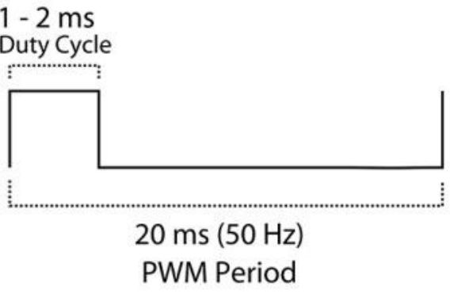
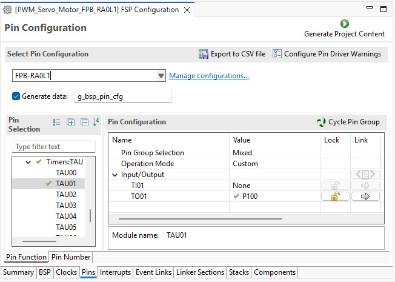
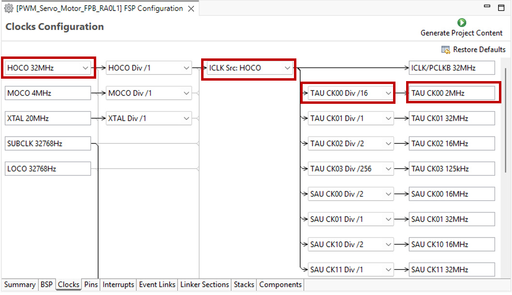
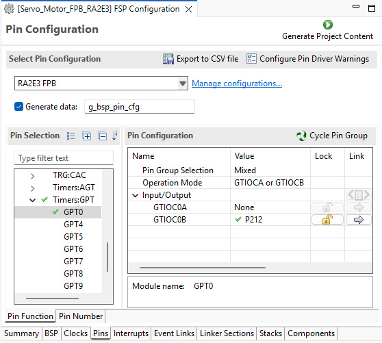
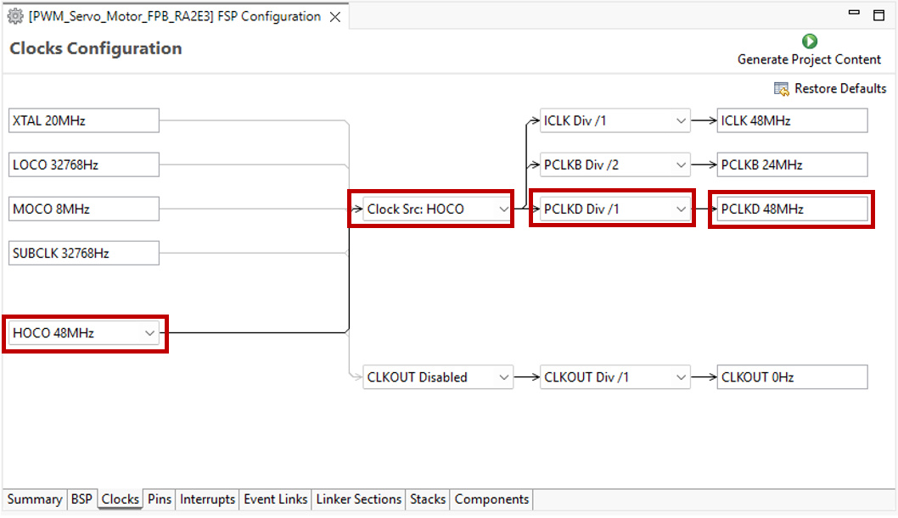
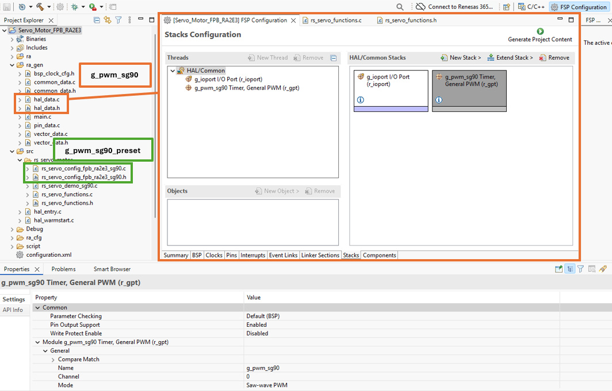
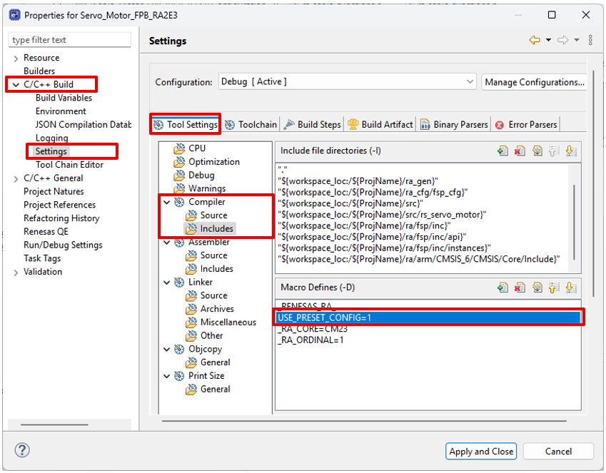
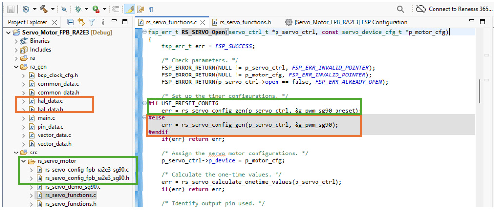
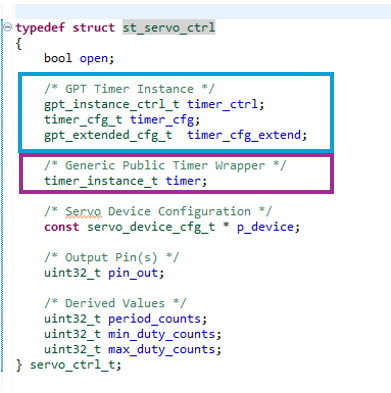
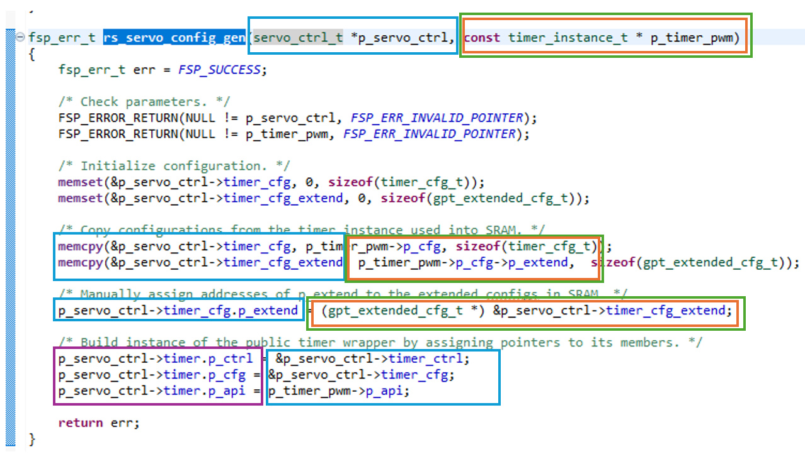

# PWM Servo Motor Control
RC servo motors are commonly used in robotics, automation, and embedded control systems to provide precise angular positioning. 
This project demonstrates how a Renesas RA2 MCU can generate PWM (pulse-width modulation) motor control signals, while providing a reusable software layer for application development.
A complete e² studio example project is included to showcase continuous servo sweep operation and provide a starting point for custom designs.

## Key Features
* RC servo motor control via a PWM signal generated from the RA FSP timer peripheral GPT
* Example e² studio project demonstrates continuous servo sweep operation
* Demo application is implemented with reusable public function layer
* Public functions support both angle-based positioning and percentage-based positioning
* Designed for integration into broader robotic and motion-control applications

***

# Repository Organization

The repository is organized into major areas:
| Area | Purpose|
|-|-|
| docs/ | Documentation for the rs_servo public instance and demonstration.|
| examples/ | Complete reference project(s) for hardware evaluation and demonstration. |
| src/ | Reusable configuration, public functions, and demonstration files. |

## Table of Contents

1. [Servo Motor Control Theory](#1-servo-motor-control-theory)
    - 1.1 [Choosing the Right FSP Timer Peripheral](#11-choosing-the-right-fsp-timer-peripheral)
        - 1.1.1 [Servo Pulse-Width Resolution](#111-servo-pulse-width-resolution)
        - 1.1.2 [Timer Configuration Constraints](#112-timer-configuration-constraints)
        - 1.1.3 [Timer Tick Resolution](#113-timer-tick-resolution)
        - 1.1.4 [Peripheral Selection](#114-peripheral-selection)
    - 1.2 [Calculating Duty-Cycles at Runtime](#12-calculating-duty-cycles-at-runtime)
        - 1.2.1 [One-time Values](#121-one-time-values)
        - 1.2.2 [Position Control by Angle](#122-position-control-by-angle)
        - 1.2.3 [Position Control by Percentage](#123-position-control-by-percentage)
2. [Application Overview](#2-application-overview)
    - 2.1 [Hardware](#21-hardware)
        - 2.1.1 [SG90 Waveform Specifications](#211-sg90-waveform-specifications)
        - 2.1.2 [FPB-RA0L1 PWM Timer Analysis](#212-fpb-ra0l1-pwm-timer-analysis)
        - 2.1.3 [FPB-RA2E3 PWM Timer Analysis](#213-fpb-ra2e3-pwm-timer-analysis)
    - 2.2 [FSP Timers Supported](#22-fsp-timers-supported)
        - 2.2.1 [R_TAU_PWM on RA0L1](#221-r_tau_pwm-on-ra0l1)
            - 2.2.1.1 [R_TAU_PWM Module Stack Config](#2211-r_tau_pwm-module-stack-config)
            - 2.2.1.2 [R_TAU_PWM Pin Config](#2212-r_tau_pwm-pin-config)
            - 2.2.1.3 [R_TAU_PWM Clock Config](#2213-r_tau_pwm-clock-config)
        - 2.2.2 [R_GPT on RA2E3](#222-r_gpt-on-ra2e3)
            - 2.2.2.1 [R_GPT Module Stack Config](#2221-r_gpt-module-stack-config)
            - 2.2.2.2 [R_GPT Pin Config](#2222-r_gpt-pin-config)
            - 2.2.2.3 [R_GPT Clock Config](#2223-r_gpt-clock-config)
3. [Public Function Layer: rs_servo](#3-public-function-layer-rs_servo)
    - 3.1 [Files](#31-files)
    - 3.2 [Public Data](#32-public-data)
        - 3.2.1 [Macros](#321-macros)
        - 3.2.2 [Servo Direction Enum](#322-servo-direction-enum)
        - 3.2.3 [Servo Device Configuration](#323-servo-device-configuration)
        - 3.2.4 [Servo Control Block](#324-servo-control-block)
    - 3.3 [Public Functions](#33-public-functions)
        - 3.3.1 [rs_servo_SweepRangeOnce()](#331-rs_servo_sweeprangeonce)
        - 3.3.2 [rs_servo_Open()](#332-rs_servo_open)
        - 3.3.3 [rs_servo_Close()](#333-rs_servo_close)
        - 3.3.4 [rs_servo_WriteAngle()](#334-rs_servo_writeangle)
        - 3.3.5 [rs_servo_WritePercent()](#335-rs_servo_writepercent)
        - 3.3.6 [Internal Functions](#336-internal-functions)
    - 3.4 [Demo Application Layer](#34-demo-application-layer)
4. [Running the Demo Application](#4-running-the-demo-application)
    - 4.1 [Required Resources](#41-required-resources)
        - 4.1.1 [Hardware](#411-hardware)
        - 4.1.2 [Software](#412-software)
        - 4.1.3 [Connect SG90 to FPB-RA0L1](#413-connect-sg90-to-fpb-ra0l1)
        - 4.1.4 [Connect SG90 to FPB-RA2E3](#414-connect-sg90-to-fpb-ra2e3)
    - 4.2 [Using FSP Stack vs Preset Configurations](#42-using-fsp-stack-vs-preset-configurations)
    - 4.3 [Note on SG90 Angle Response](#43-note-on-sg90-angle-response)
5. [Limitations](#5-limitations)
6. [Integration / Reusability](#6-integration--reusability)
    - 6.1 [Inside the Demo Application](#61-inside-the-demo-application)
        - 6.1.1 [Demo Application Using FSP Configuration](#611-demo-application-using-fsp-configuration)
        - 6.1.2 [Demo Application Using a Different Servo Motor](#612-demo-application-using-a-different-servo-motor)
    - 6.2 [Inside a Custom Application](#62-inside-a-custom-application)
        - 6.2.1 [Public Function Layer](#621-public-function-layer)
        - 6.2.2 [GPT Timer Configuration](#622-gpt-timer-configuration)
        - 6.2.3 [Public Data Configuration](#623-public-data-configuration)
        - 6.2.4 [Servo Initialization](#624-servo-initialization)
        - 6.2.5 [Servo Position Update](#625-servo-position-update)
        - 6.2.6 [Servo Shut-down](#626-servo-shut-down)
        - 6.2.7 [Drive Multiple Servo Motors](#627-drive-multiple-servo-motors)

***
# 1. Servo Motor Control Theory
An RC servo is controlled through a PWM signal, which is a series of repeating pulses of variable width. 
The width of the pulse determines the angular position of the servo. 

For a given servo, the spec sheet will provide three parameters to describe the pulses: 
* the minimum pulse width 
* the maximum pulse width
* the repetition rate

The parameters are also commonly referred to as the minumum duty cycle, maximum duty cycle, and PWM period (or frequency).

Standard 180-degree servos have parameter values of 1ms, 2ms, and 20ms (50 Hz), respectively. There are some servos with values that stray from this norm, but it is uncommon.

## 1.1 Choosing the Right FSP Timer Peripheral
On RA2 MCUs both the AGT (Asynchronous General Purpose Timer) and GPT (General PWM Timer) peripherals are capable of generating PWM signals to control servos.
On all RA MCUs this list expands to include the TAU (Timer Array Unit) and the ULPT (Ultra Low-Power Timer). 

To select the appropriate timer on the MCU, analyze each peripheral's characteristics in relation to the servo's pulse parameters. 

The timer must have the right combination of counter width, clock source frequency, and clock source division ratio to satisfy every position of the servo.

Essentially this is answering the following in combination: 
* Can the timer achieve the right resolution to represent every position of the servo? 
* Can the timer counter width fit the full servo PWM period? 

### 1.1.1 Servo Pulse-Width Resolution
The servo's minimum pulse-width change between adjacent positions can be referred to as the servo's pulse-width resolution. 

To calculate, use the following formula:

```text
                         (Maximum Pulse Width - Minimum Pulse Width)
Pulse-Width Resolution = ------------------------------------------
                                    Number of Positions
```
 
### 1.1.2 Timer Configuration Constraints
The timer peripheral's configured clock source frequency and divider must allow the servo's PWM period to fit within the timer's maximum counter value. 

The maximum timer count is determined by the timer's counter width (in bits):
```text
Maximum Timer Count = 2 ^ (Counter Width)
```
For a 16-bit timer, the Maximum Timer Count = 65,535 <br>
For a 32-bit timer, the Maximum Timer Count = 4,294,967,295 <br>

To determine the timer's required counts for a given servo's PWM period, use:
```text
                    Clock Source 
Required Counts = ---------------  x  PWM Period
                       Divider
```

Then lastly, solve the following equation for a valid combinations of values for clock source frequency and clock divider. 
```text
Required Counts ≤ Maximum Timer Count
```

Use the Hardware User's Manual to verify the clock source and divider values are valid settings for the timer in question.

### 1.1.3 Timer Tick Resolution
Once a valid source clock frequecy and divider combination is found, use the following formula to verify the resolution between timer ticks:

```text
                      Divider 
Tick Resolution = ---------------
                    Clock Source
```
### 1.1.4 Peripheral Selection
For precise motor positioning, the timer tick resolution must be finer than the minimum pulse-width change between adjacent positions of the servo.
If not, multiple servo positions may map to the same timer count value, reducing positioning accuracy.

Ensure:
```text
Timer Tick Resolution < Servo Pulse-Width Resolution
```

## 1.2 Calculating Duty-Cycles at Runtime
Servo position is controlled by varying the PWM pulse width. Each valid servo position corresponds to a pulse width between the specified minimum and maximum duty cycles.

Each FSP timer's drivers include a `DutyCycleSet()` API to update the PWM pulse width at runtime. It accepts the new duty cycle value in units of raw timer counts. 

The maximum raw timer count (determined by the timer's counter width) represents the servo's full PWM period. To set a specific servo position, calculate a new pulse width (in raw counts) as the right fraction between the servo's minimum and maximum pulse widths.

### 1.2.1 One-time Values
Firstly, calculate the servo's minumum and maximum duty cycles as raw timer counts. Then use these values to calculate subsequent updates to timer's PWM duty cycle.

The FSP timer API `InfoGet()` can get the clock frequency and clock period (in raw counts) of any open timer.

**Minimum Duty Count**
```text
                         Min Duty Cycle (us) x Clock Frequency (Hz)
Minimum Duty Count =  -----------------------------------------------
                                    (# us per second)
```

**Maximum Duty Count**
```text
                         Max Duty Cycle (us) x Clock Frequency (Hz)
Maximum Duty Count =  -----------------------------------------------
                                    (# us per second)
```

### 1.2.2 Position Control by Angle
The most common control method is to specify a target angle. The driver converts the requested angle into the corresponding duty-cycle count between the configured minimum and maximum pulse widths.

For a 180° servo, this provides up to 180 discrete position steps across the servo's operating range.

**Duty Cycle by Angle**


```text
                                         Target Angle 
Duty Cycle Count = Minimum Duty Count + --------------- x (Maximum Duty Count - Minimum Duty Count)
                                          # of Angles
```

### 1.2.3 Position Control by Percentage
An alternative control method is to specify the desired position as a percentage of the servo's travel range. A value of 0% corresponds to the minimum pulse width, while 100% corresponds to the maximum pulse width.

This approach provides 100 discrete position steps across the servo's operating range.

**Duty Cycle by Percentage**
```text
                                         Target Percent 
Duty Cycle Count = Minimum Duty Count + ---------------- x (Maximum Duty Count - Minimum Duty Count)
                                              100
```

***

# 2. Application Overview
This project applies the servo control theory described in the previous sections to control an SG90 servo motor connected to an FPB-RA2E3 board. 

After initialization, the application continuously sweeps the servo shaft through its full range of motion by stepping through each angle from 0° to 180°, returning back to 0°, and pausing for one second before repeating the cycle. 

The project provides a public function layer which includes routines for setting a servo's specifc position by angle or percentage. The application utilizes the single entry point function to perform one full sweep of the SG90 range.

Together, these features demonstrate how RA MCU timer peripherals can be used to implement accurate and reusable servo motor control.

## 2.1 Hardware
The demo application(s) run on the following hardware: 

RA MCU(s):
* FPB-RA0L1 MCU
    * [RA0L1 Group User's Manual: Hardware ](https://www.renesas.com/en/document/mah/ra0l1-group-users-manual-hardware)
* FPB-RA2E3 MCU
    * [RA2E3 Group User's Manual: Hardware ](https://www.renesas.com/en/document/mah/ra2e3-group-users-manual-hardware)

Servo Peripheral:
* SG90 Servo Motor
    * [SG90 Datasheet ](http://www.ee.ic.ac.uk/pcheung/teaching/DE1_EE/stores/sg90_datasheet.pdf)

### 2.1.1 SG90 Waveform Specifications
The SG90 is a 180° counter-clockwise rotating servo with the following PWM pulse parameters
* Minimum pulse (represents -90°) = 1 ms
* Maximum pulse (represents 90°) = 2 ms
* PWM period = 20ms

<br>


Calculate the Servo PWM Resolution: 
```text
(Maximum Duty Cycle - Minimum Duty Cycle) / (Number of Positions) 
= (2ms - 1ms)/ (180°) 
= 5.5 us/degree
```

So each angle is represented by a pulse change about 5.5 us.

### 2.1.2 FPB-RA0L1 PWM Timer Analysis
This section follows the analysis outlined in the Servo Motor Control Theory subsection [Choosing the Right FSP Timer Peripheral](#11-choosing-the-right-fsp-timer-peripheral).

The FPB-RA0L1 has 1 peripheral capable of generating PWM waveforms: the TAU. 
To verify the timer's capability and find appropriate settings, analyze the TAU's clock settings in relation to the SG90 PWM signal requirements.

The TAU has the following features:
* Counter Width: 16 bit
* Clock Source: PCLKB, with input from HOCO @32MHz
* Clock Division: /1, /2, /4, /8, /16, /32, ..., /32768

```text
TAU Max Count = 2^(16) = 65,535

Required Counts for PWM period: (32MHz / DIV) X (20ms)
```
Solve the following equation for the right division ratio (DIV) when PCLKB's input source is 32MHz:

```text
Required Counts ≤ Max Count 
(32MHz/ DIV) x (20ms) ≤ 65,535
9.76 ≤ DIV 
```

Rounding up to the next available setting as a power of 2, DIV = 16.

Find the resulting Timer Tick Resolution:
```text
TAU Tick Resolution = DIV/CLK = 16/(32MHz) = 0.5 us
```

The resulting Tick Resolution of 0.5 us is much less than the Servo PWM Resolution of 5.5 us. 

When the TAU has a clock source of 32MHz and a division ratio of 16, the timer can represent every angle of the servo motor accurately and fit the full PWM period in the counter.

### 2.1.3 FPB-RA2E3 PWM Timer Analysis
This section follows the analysis outlined in the Servo Motor Control Theory subsection [Choosing the Right FSP Timer Peripheral](#11-choosing-the-right-fsp-timer-peripheral).

The FPB-RA2E3 has 2 peripherals capable of generating PWM waveforms: the GPT and the AGT. 
Choosing the right timer requires analyzing the clock specifications in relation to the SG90 PWM signal requirements. 

**GPT**<br>
The GPT has the following features:
* Counter Width: 32 & 16 bit options
* Source Clock: PCLKD, with input from HOCO @48MHz 
* Clock Division: /1, /4, /16, /256, /1024

```text
GPT Max Count = 2^(32) = 4,294,967,295

Required Counts for PWM period = (48MHz / DIV) x (20ms) 
```

Solve the following equation for the right division ratio (DIV) when PCLKD's input source is 48MHz: 
```text
Required Counts ≤ Max Count 
(48MHz/ DIV) x (20ms) ≤ 4,294,967,295 
0.02 ≤ DIV 
```
Rounding up to the next available setting,  DIV = 1. 

Find the resulting Timer Tick Resolution:
```text
GPT Tick Resolution = DIV/CLK = 1/(48MHz) = 0.02 us
```
The resulting Tick Resolution of 0.02 us is much less than the Servo PWM Resolution of 5.5 us. When the GPT has a clock source of 48MHz and a division ratio of 1, the timer can represent every angle of the servo motor accurately and fit the full PWM period in the counter.

**AGT**<br>
The Low Power AGT has the following features: 
* Counter width: 16 bit
* Source Clock: PCLKB, with input from HOCO @48Hz
* Clock Division: /1, /2, /8

```text
AGT Max Count = 2^(16) = 65,535

Required Counts for PWM perod = (48MHz / DIV) x (20ms) 
```
Solve the following equation for the right division ratio (DIV) when PCLKB's input source is 48MHz: 
```text
Required Counts ≤ Max Count 
(48MHz/ DIV) x (20ms) ≤ 65,535
14.64 ≤ DIV 
```

Rounding up to the closest valid ratio gives DIV = 16. However, notice that the the max clock division ratio setting is /8. So this AGT module is NOT able to create a PWM signal that can represent every anglular position of the servo motor. 

## 2.2 FSP Timers Supported
The following timer modules are supported by the servo motor control layer. 

| MCU | PWM Timer Module | Usage |
|-|-|-|
| RA0L1 | TAU PWM | Create a variable duty-cycle PWM signal to control the SG90 motor |
| RA2E3 | GPT | Create a variable duty-cycle PWM signal to control the SG90 motor |

### 2.2.1 R_TAU_PWM on RA0L1 
The TAU PWM module on the RA0L1 generates the PWM output. 

#### 2.2.1.1 R_TAU_PWM Module Stack Config
The following non-default FSP properties enable the R_TAU_PWM on the FPB-RA0L1 to control the SG90 servo:

**Simultaneous Channel Operation**
| Property Name | Value Used | Reason |
|-|-|-|
| Common → Interrupt Support | Disabled | PWM generation does not need interrupt support. |
| General → Name | g_pwm_sg90 | Descriptive name. |
| General → Period | 50 | The SG90 PWM period is 20ms which gives 50 Hz. |
| General → Period Unit | Hz | Set the right unit Hz. |
| Interrupts → Interrupt Priority | Disabled | PWM generation does not need interrupt callback. |

**TAU PWM Channel 1 Configuration**
| Property Name | Value Used | Reason |
|-|-|-|
| Output → PWM Duty Cycle Percent | 5 | A 5% duty cycle gives a 1ms pulse, corresponding to the -90° position. The TAU will initialize with this duty cycle. |
| Interrupts → Interrupt Priority | Disabled | PWM generation does not need interupt. |
| Pins → TO01 | P100 | Ensure the pin settings to make P100 available as TAU slave channel 1 output. |

#### 2.2.1.2 R_TAU_PWM Pin Config
The following pin configurations used in the project route the TAU PWM signal to output pin P100.

<br>

#### 2.2.1.3 R_TAU_PWM Clock Config
Based on the calculations in section [FPB-RA0L1 PWM Timer Analysis](#212-fpb-ra0l1-pwm-timer-analysis), the following clock tree settings were used for TAU:

<br>

### 2.2.2 R_GPT on RA2E3
The GPT module on the RA2E3 generates the PWM output. 

#### 2.2.2.1 R_GPT Module Stack Config
The following non-default FSP properties enable the R_GPT on the FPB-RA2E3 to control the SG90 servo:

| Property Name | Value Used | Reason |
|-|-|-|
| Common → Pin Output Support | Enabled | Route the PWM signal through the MCU's pins. |
| General → Name | g_pwm_sg90 | Descriptive name. |
| General → Channel | 0 | The 32-bit wide GPT channel is assigned to channel 0. |
| General → Mode | Saw-Wave PWM | The operation mode for generating a PWM signal. |
| General → Period | 50 | The SG90 PWM period is 20ms which gives 50 Hz. |
| General → Period Unit | Hz | Set the right unit Hz. |
| Output → Duty Cycle Percent | 5 | A 5% duty cycle gives a 1ms pulse, corresponding to the -90° position. The GPT will initialize with this duty cycle. |
| Output → GTIOCB Output Enabled | True | Choose any non-conflicting output pin on either GTIOCA or B to output the PWM control signal. In this example the output is assigned to P212 on GTIOC0B. |
| Pins → GTIOCB | P212 | Ensure the pin settings to make P212 available as GTIOCB output. |

#### 2.2.2.2 R_GPT Pin Config 
The following pin configurations used in the project route the GPT PWM signal to output pin P212 on GTIOCB. 

<br>

#### 2.2.2.3 R_GPT Clock Config
Based on the calculations in section [FPB-RA2E3 PWM Timer Analysis](#213-fpb-ra2e3-pwm-timer-analysis), the GPT was selected and the following clock tree settings were used:

<br>

***

# 3 Public Function Layer: rs_servo

The servo motor public function layer **rs_servo** is detailed here.

## 3.1 Files
The source files can be found in the repo's /src folder and are located in the e² studio project's /src/rs_servo_motor folder. 


| File | Contents |
|-|-|
| rs_servo_functions.c | Contains the public-function defitions for the **rs_servo** layer, along with internal helper functions. |
| rs_servo_functions.h | Contains the public data to support the **rs_servo** functions. Any application files calling the public functions need to include this file. |
| rs_servo_demo.c | Application layer which uses the public functions and data to demo a repeated sweep of the SG90 servo motor through its angle range. |
| rs_servo_config_fpb_ra0l1_sg90.c | Pre-configured control structure for the instance of the TAU PWM HAL driver. Values are hardware-dependent on the FPB-RA0L1 and SG90 servo. |
| rs_servo_config_fpb_ra0l1_sg90.h | Contains the FSP header files required for the project and external references to the control, config, and FSP API structures needed for the TAU PWM HAL. |
| rs_servo_config_fpb_ra2e3_sg90.c | Pre-configured control structure for the instance of the GPT HAL driver. Values are hardware-dependent on the FPB-RA2E3 and SG90 servo. |
| rs_servo_config_fpb_ra2e3_sg90.h | Contains the FSP header files required for the project and external references to the control, config, and FSP API structures needed for the GPT HAL. |

> ℹ To use the **rs_servo** layer, copy the rs_servo_functions .c and .h file into the target project's source folder. Include the rs_servo_function.h file in each application file that uses the layer.

The **rs_servo** can work exclusively with either the GPT or the PWM TAU module, by defining a macro "PWM_SERVO_USE_GPT" or "PWM_SERVO_USE_TAU", respectively. **It is prohibited to define both macros in the same application project.**
This macro controls whether the GPT timer instance or TAU PWM timer instance will be defined in the *servo_ctrl_t* struct.

In the demo application, the macro "PWM_SERVO_USE_\<Timer Module\>" is defined in the file rs_servo_config_\<RA Device Kit\>_sg90.h

## 3.2 Public Data
The public data are defined in rs_servo_functions.h. The data is composed of an enumeration for the servo direction, a configuration struct for the servo's specifications, and a control struct for the public function layer.

### 3.2.1 Macros
The following macros are defined in the rs_servo_functions.c file and support the public functions.

| Name | Value | Use |
|-|-|-|
| RS_SERVO_DELAY_100MS | 100 | Used for a 100ms delay between incrementing angle calls in the sweep function. |
| RS_SERVO_DELAY_1S | 1000 | Used for a 1s (1000ms) delay when the sweep function moves from the max angle back to the min. |
| RS_SERVO_DELAY_US_PER_SECOND | 1000000ULL | The number of microseconds in a second. Used in the servo position update functions to calculate the new duty cycle count. |
| RS_SERVO_MIN_PERCENTAGE | 0 | Minimum percent. Used in the write percent function to ensure valid input. | 
| RS_SERVO_MAX_PERCENTAGE | 100 | Maximum percent. Used in the write percent function to ensure valid input. |

```c
#define RS_SERVO_DELAY_100MS     (100)
#define RS_SERVO_DELAY_1S        (1000)
#define RS_SERVO_US_PER_SECOND   (1000000ULL)
#define RS_SERVO_MIN_PERCENTAGE  (0U)
#define RS_SERVO_MAX_PERCENTAGE  (100U)
#define RS_SERVO_MAX_ANGLE_CFG   (360)
#define RS_SERVO_MIN_ANGLE_CFG   (-180)
```

### 3.2.2 Servo Direction Enum

The type *servo_direction_t* provides the directions that can describe the servo's rotation. 

```c
/* Servo Direction Enum */
typedef enum e_servo_direction_t
{
    SERVO_DIRECTION_DEFAULT,
    SERVO_DIRECTION_REVERSE,
} servo_direction_t;
```

### 3.2.3 Servo Device Configuration

The type *servo_device_t* is dependent on the selected servo's hardware and describes its PWM pulse's specifications and shaft's rotational direction.

> ℹ The main application layer must define a const *servo_device_cfg_t* and initialize the members to the chosen servo's specifications in the datasheet. 

| Member Name | Type |  Use |
|-|-|-| 
| minimum_angle | int16_t | The minimum angle of the servo's range. Corresponds to the minumum duty cycle. | 
| maximum_angle | int16_t | The maximum angle of the servo's range. Corresponds to the maximum duty cycle. |
| minimum_microseconds | uint16_t | The PWM pulse's minimum duty cycle in microseconds. |
| maximum_microseconds | uint16_t | The maximum duty cycle in microseconds. |
| direction | servo_direction_t | The direction of the servo shaft's rotaion. |

> ℹ Depending on preference, a 180° servo motor's angle range can be specified either from -90° to 90° or from 0° to 180°. And similarly, 360° motors can be either -180° to 180 or 0 to 360°. The public functions will verify input are within this range. 

```c
/* Servo Device Configuration */
typedef struct st_servo_device_cfg
{
    int16_t minimum_angle;
    int16_t maximum_angle;
    uint16_t minimum_microseconds;
    uint16_t maximum_microseconds;
    servo_direction_t direction;
} servo_device_cfg_t;
```

The SG90 demo application in rs_servo_demo_sg90.c defines the servo range from -90° to 90° and maps it to a pulse width from 1000 µs to 2000 µs.
```c
const servo_device_cfg_t g_sg90_motor_cfg =
{
    .minimum_angle = -90,
    .maximum_angle = 90,
    .minimum_microseconds = 1000,
    .maximum_microseconds = 2000,
    .direction = SERVO_DIRECTION_DEFAULT
};
```
### 3.2.4 Servo Control Block

The type *servo_ctrl_t* provides a control block for the **rs_servo** functions. To guarantee proper operation of this layer, application code should never write over any members of a *servo_ctrl_t* instance. 


| Member Name | Type |  Use |
|-|-|-|
| open | bool | The servo module's current state. |
| timer_ctrl | gpt_instance_ctrl_t, tau_pwm_instance_ctrl_t | SRAM copy of the control struct for use by the GPT HAL. |
| timer_cfg | timer_cfg_t | SRAM copy of the config struct for use by the the GPT or TAU PWM HAL. |
| timer_cfg_extend | gpt_extended_cfg_t, tau_pwm_extended_cfg_t | SRAM copy of the extended config struct for use by the GPT or TAU PWM HAL. |
| timer | timer_instance_t | Generic public timer wrapper for the GPT or TAU instance in RAM. Creating a wrapper allows the rs_servo layer to call FSP timer APIs with timer-agnostic function pointers. |
| p_device | const servo_device_cfg_t * | Pointer to a constant servo_device_cfg_t that describes the behavior of the servo peripheral. |
| pin_out | uint32_t | The output pins configuration of the underlying timer instance. |
| period_counts | uint32_t | The number of timer counts for the servo's full PWM period. This value is calculated one-time when the module opens and is used in subsequent duty cycle updates. |
| min_duty_counts | uint32_t | The number of timer counts for the servo's minimum PWM duty cycle. This value is calculated once per open. |
| max_duty_counts | uint32_t | The number of timer counts for the servo's maximum PWM duty cycle. This value is calculated once per open. |

The SG90 demo application in rs_servo_demo_sg90.c creates a control instance for each servo motor.
 ```c
 servo_ctrl_t g_sg90_servo_ctrl = {0};
 ```

> ℹ The main application layer must define a *servo_ctrl_t* instance initialized to 0. This instance will be passed into **rs_servo** function calls. 

## 3.3 Public Functions

The public functions are defined in the file rs_servo_functions.c. 

> ℹ To use the functions in an application, ensure the rs_servo_functions .c and .h file are in the target project's source folder and #include the rs_servo_function.h file in each application file that uses the layer.

This section breaks down the servo functions for a beginner user and an advanced user: 
- **Beginner:** Intended for new users evaluating the module. The application code needs only to define a servo_device_cfg_t and call the single-point entry function rs_servo_SweepRangeOnce. All other behavior, like opening HAL drivers and updating the GPT duty cycle to control the servo at runtime, is managed internally.
- **Advanced:** Intended for users experienced in developing embedded applications with the Renesas FSP HAL and familiar with servo control by PWM. Advanced users can control the full module lifecycle for targeted use-case applications.

| Function | Module State | User Level | Description |
|-|-|-|-|
| rs_servo_SweepRangeOnce(servo_ctrl_t *, const servo_device_cfg_t *) | Open, Closed | Beginner |  The function steps through every angle from the minimum angle to the maximum angle with a 100 ms delay between each position update. After reaching the maximum angle, the servo returns directly to the minimum angle and pauses for 1 second.|
| rs_servo_Open(servo_ctrl_t *, const servo_device_cfg_t *) | Closed | Advanced | Initializes the servo control instance and starts PWM output at the minimum configured servo angle. |
| rs_servo_Close(servo_ctrl_t *) | Open |  Advanced | Closes the servo module and stops the PWM output. |
| rs_servo_WriteAngle(servo_ctrl_t *, int16_t) | Open | Advanced | Moves the servo to a requested angle within the configured range. |
| rs_servo_WritePercent(servo_ctrl_t * p_servo_ctrl, uint8_t percent) | Open | Advanced | Moves the servo to the requested position within the configured range. |
| rs_servo_config_gen(servo_ctrl_t *, const timer_instance_t *) | - | INTERNAL ONLY | During open, copies the selected FSP timer instance configuration into the servo control structure. |
| rs_servo_config_check(const servo_ctrl_t *) | - | INTERNAL ONLY | After config gen, checks that the servo control members the servo motor device configurations are correct. |
| rs_servo_calculate_onetime_values(servo_ctrl_t *) | - | INTERNAL ONLY | During open, calculates runtime values that are used in subsequent calls to WritePercent() or WriteAngle() to calculate the new duty cycle. |

All functions returns a fsp_err_t value to describe the success of the function's operation:
| Error | Description |
|-|-|
| *FSP_SUCCESS* | The function returned successfully with no error. |
| *FSP_ERR_INVALID_POINTER* | Pointer points to an invalid memory location. |
| *FSP_ERR_INVALID_ARGUMENT* | Invalid input parameter. |
| *FSP_ERR_INVALID_MODE* | The current settings are unsupported or an incorrect mode. |
| *FSP_ERR_ALREADY_OPEN* | The module is already open, which is an invalid state. |
| *FSP_ERR_NOT_OPEN* | The module is not open, which is an invalid state. |

### 3.3.1 rs_servo_SweepRangeOnce() 
Beginner-level single entry point function to the **rs_servo**. <br>
Valid Module State: Open and Closed

```c
fsp_err_t rs_servo_SweepRangeOnce(servo_ctrl_t *p_servo_ctrl, const servo_device_cfg_t *p_motor_cfg)
```

This function performs one complete sweep of the servo's configured angle range. It takes pointers to the servo control instance *p_servo_ctrl* and to the motor configuration *p_motor_cfg*.

If the servo module's control instance is not already open, the function opens it and starts PWM output at the minimum configured angle. If the instance is already open, the function first returns the servo to the minimum angle.

The function then steps through every angle from the minimum angle to the maximum angle with a 100 ms delay between each position update. After reaching the maximum angle, the servo returns directly to the minimum angle and pauses for 1 second.

Error Returns: 
- FSP_SUCCESS
- FSP_INVALID_POINTER


### 3.3.2 rs_servo_Open()
Advanced-level function to open an instance of **rs_servo**.<br>
Valid Module State: Closed

```c
fsp_err_t rs_servo_Open(servo_ctrl_t *p_servo_ctrl, const servo_device_cfg_t *p_motor_cfg);
```
rs_servo_Open initializes the servo control instance and starts PWM output at the minimum configured servo angle.

This function performs the following operations:

1. Validates the input pointers.
2. Confirms that the servo instance is not already open.
3. Copies the configured GPT timer instance into the servo control structure.
4. Assigns pointer to the user-defined servo motor configuration.
5. Calculates the minimum and maximum duty-cycle counts from the configured pulse-width limits.
6. Determines which timer output pin is enabled.
7. Opens the GPT timer.
8. Sets the initial duty cycle to the minimum servo position.
9. Starts the timer.
10. Marks the servo instance as open.

### 3.3.3 rs_servo_Close()
Advanced-level function to close an instance of **rs_servo**.<br>
Valid Module State: Closed

```c
fsp_err_t rs_servo_Close(servo_ctrl_t *p_servo_ctrl);
```
Closes the GPT timer instance used by the servo control layer and marks the servo control instance as closed. This function validates that the servo control pointer is not NULL and that the servo instance is currently open before closing the timer.

### 3.3.4 rs_servo_WriteAngle()
Advanced-level function to move the servo to the specified angle.<br>
Valid Module State: Open

```c
fsp_err_t rs_servo_WriteAngle(servo_ctrl_t *p_servo_ctrl, int16_t angle);
```
Moves the servo to a requested angle within the configured servo range.

The function first checks that the servo instance is open and that the requested angle is between the configured minimum and maximum angles. It then normalizes the angle relative to the configured minimum angle and maps it into the configured duty-cycle count range.

The new duty-cycle count *pulse_counts* is calculated using the relationship:
```c
pulse_counts = min_duty_counts +
               ((adjusted_angle * duty_range_counts) / angle_range_counts);
```
where:
```c
angle_range_counts = maximum_angle - minimum_angle;
duty_range_counts  = max_duty_counts - min_duty_counts;
adjusted_angle     = angle - minimum_angle;
```

If the servo direction is configured as SERVO_DIRECTION_REVERSE, the adjusted angle is inverted before calculating the duty-cycle count.

After the pulse count is calculated, the function verifies that the resulting duty-cycle value is less than the configured PWM period count, then updates the GPT output duty cycle using the FSP timer API.

### 3.3.5 rs_servo_WritePercent()
Advanced-level function to move the servo to the specified angle.<br>
Valid Module State: Open

```c
fsp_err_t rs_servo_WritePercent(servo_ctrl_t *p_servo_ctrl, uint8_t percent);
```
rs_servo_WritePercent moves the servo to a relative position within the configured travel range.

The percent input is a relative position command from 0 to 100, where:
- 0 corresponds to the configured minimum servo position.
- 100 corresponds to the configured maximum servo position.

This function does not directly set a raw timer duty-cycle percentage. Instead, it moves the servo motor to the requested percentage of the pulse-width range.

The new duty-cycle count *pulse_counts* is calculated using:
```c
pulse_counts = min_duty_counts +
               ((adjusted_percent * duty_range_counts) / 100);
```
If the servo direction is configured as SERVO_DIRECTION_REVERSE, the adjusted percent is inverted before calculating the duty-cycle count.

This function is useful when the application needs a normalized 0–100 position command instead of an angle-based command.

### 3.3.6 Internal Functions
The following helper functions are declared in the rs_servo_functions.h in the current implementation, but they are only used internally by the servo function rs_servo_Open(). 

**Config Gen Function**
```c
fsp_err_t rs_servo_config_gen(servo_ctrl_t *p_servo_ctrl, const timer_instance_t *p_timer_pwm);
```

The rs_servo_config_gen() copies the FSP GPT timer instance configuration in flash into the servo control structure. This allows the servo layer to maintain a RAM copy of the timer control block, timer configuration, and GPT extended configuration.

The function also rebuilds the public timer wrapper by assigning the local control block, local configuration, and timer API pointer.

**Config Check Function**
```c
fsp_err_t rs_servo_config_gen(const servo_ctrl_t *p_servo_ctrl)
```

The rs_servo_config_check() is called after the rs_config_gen() returns succesfully and the servo device configuration has been copied into the servo control structure. 

This function checks whether the following statements are true, and returns an error if not:
- the servo control has a valid pointer to a servo device configuration struct
- the following servo device configurations are within proper bounds:
    - Minimum angle is greater than or equal to -180
    - Maximum angle is less than or equal to 360
    - Direction is a valid servo_direction_t
- the public timer wrapper in the servo control properly encapsulates the ctrl, cfg and extended cfg from the servo control struct

**Calculate One-Time Values Function**
```c
fsp_err_t rs_servo_calculate_onetime_values(servo_ctrl_t *p_servo_ctrl);
```
The rs_servo_calculate_onetime_values retrieves the GPT timer information and calculates helper values for the servo control block. The precalculated values (period_counts, min_duty_counts and max_duty_counts) are used by subsequent calls to rs_servo_WriteAngle() and rs_servo_WritePercent(). 

The minimum and maximum duty-cycle counts are calculated from the servo pulse-width limits and the timer clock frequency:
```c
min_duty_counts = (minimum_microseconds * timer_clock_frequency) / RS_SERVO_US_PER_SECOND;
max_duty_counts = (maximum_microseconds * timer_clock_frequency) / RS_SERVO_US_PER_SECOND;
```

## 3.4 Demo Application Layer

The servo application demo's entry is defined in rs_servo_demo.c. It uses the beginner-level single entry point function rs_servo_SweepRangeOnce() to perform repeated sweeps of the SG90 range. During normal operation, the servo moves through every configured angle from -90 degrees to 90 degrees, then returns to -90 degrees and pauses for one second before the next sweep begins.

The demo application defines an SG90 servo configuration and creates a servo control instance:
```c
const servo_device_cfg_t g_sg90_motor_cfg =
{
    .minimum_angle = -90,
    .maximum_angle = 90,
    .minimum_microseconds = 1000,
    .maximum_microseconds = 2000,
    .direction = SERVO_DIRECTION_DEFAULT
};

servo_ctrl_t g_sg90_servo_ctrl = {0};
```

The demo application layer repeatedly calls rs_servo_SweepRangeOnce().
```c
fsp_err_t servo_demo_entry(void)
{
    fsp_err_t err = FSP_SUCCESS;

    while(err == FSP_SUCCESS)
    {
        err = rs_servo_SweepRangeOnce(&g_sg90_servo_ctrl, &g_sg90_motor_cfg);
    }

    err = rs_servo_Close(&g_sg90_servo_ctrl);

    return err;
}
```

***

# 4. Running the Demo Application

The example application titled "PWM_Servo_Motor_FPB_RA2E3" is located in /examples/e2studio and /examples/vscode. 

## 4.1 Required Resources
To build and run the project, the following resources are needed:

### 4.1.1 Hardware
* Renesas RA MCU 
    * FPB-RA0L1
    * FPB-RA2E3 
* USB Debug Cable
* SG90 Servo Motor
* Jumper Wires to connect SG90 to RA MCU

### 4.1.2 Software
* e² studio v2026-04.2
* VS Code with Renesas Platform Extension
* FSP v6.5.0
* LLVM for ARM v21.1.1

### 4.1.3 Connect SG90 to FPB-RA0L1 
Connect the SG90 to the FPB-RA2E3:

    * (+) SG90 goes to (5V) MCU
    * (-) SG90 goes to (GND) MCU
    * (PWM) SG90 goes to (P100) MCU

### 4.1.4 Connect SG90 to FPB-RA2E3 
Connect the SG90 to the FPB-RA2E3:

    * (+) SG90 goes to (5V) MCU
    * (-) SG90 goes to (GND) MCU
    * (PWM) SG90 goes to (P212) MCU

## 4.2 Using FSP Stack vs Preset Configurations 
In the project, the required GPT module settings are saved in flash and at runtime are copied into SRAM for use by the FSP APIs. 
There are 2 identical flash copies of the required configurations in the project:
* g_pwm_sg90 
    * Located in /ra_gen folder in hal_data.c and .h
    * Data is auto generated based on the project's FSP Stack and Pin configurations
* g_pwm_sg90_preset
    * Located in /src/rs_servo_motor directory in rs_servo_config_fpb_ra2e3_sg90. and .h
    * Data is identical copy of the FSP configurations and is tailored for the hardware

For guaranteed demo operation, do not edit these files or overwrite the project's original FSP Configurations. 
 
The following image shows the files containing the flash configuration copies in the project's workspace. The FSP configuration files with flash instance **g_pwm_sg90** are highlighted in orange and those with flash instance **g_pwm_sg90_preset** are highlighted in green.

<br>

The macro USE_PRESET_CONFIG is defined in the Project Properties > C/C++ Build settings. It determines which flash configuration will be copied into SRAM at runtime. Its value can be set using the project property shown below:

 C/C++ Build > Settings > Tool Settings tab > Compiler > Includes > Macro Defines section" width="500"/><br>

The rs_servo_Open() routine automatically calls the internal routine rs_servo_config_gen() with the GPT instance that corresponds to the value of USE_PRESET_CONFIG.
* USE_PRESET_CONFIG = 1 selects **g_pwm_sg90_preset**
* USE_PRESET_CONFIG = 0 selects **g_pwm_sg90**

<br>

The SRAM copy is stored as multiple members of the servo control block *servo_ctrl_t* and are highlighted in blue below. The configurations are additionally wrapped up by a public timer instance in SRAM highlighted in purple.

<br>

The rs_servo_config_gen() routine first copies the GPT configuration flash instances into the servo control block, then it wraps them all in the public timer instance:

<br>

## 4.3 Note on SG90 Angle Response
The SG90 datasheet commonly specifies a control pulse width range of 1 ms to 2 ms, corresponding to approximately -90° to +90° (180° total travel). In practice, however, the SG90 is a low-cost hobby servo and its actual mechanical range can vary significantly between units.

Many SG90 servos do not achieve a full 180° sweep when driven with 1 ms and 2 ms pulse widths. Manufacturing tolerances, gear alignment, internal potentiometer calibration, and mechanical end stops often limit the usable travel to less than the advertised range. It is therefore normal to observe total motion less than 180°, sometimes as limited as 90°.

For applications requiring precise angular positioning, the relationship between pulse width and output angle can be characterized experimentally on the target hardware rather than relying solely on the values stated in the datasheet. However, driving beyond the servo's actual mechanical limits can cause increased current consumption, audible buzzing, heat generation, and premature wear.

The risk of experimental maximum and minimum microsecond settings is assumed by the user. 

***

# 5. Limitations
The current implementation has the following limitations:

- The public function layer currently supports GPT timer peripherals only.
- All PWM outputs used by the public function layer must originate from the same GPT/TAU PWM channel configuration. Independent servo outputs require independent timer instances.
- Each independently controlled servo motor requires:
    - A dedicated GPT or TAU PWM timer instance, exclusively.
    - A dedicated `servo_ctrl_t` control structure.
    - A dedicated `servo_device_cfg_t` configuration structure.
- The public function layer assumes the PWM period and timer configuration are configured correctly for the target servo motor.
- Only position-based control is supported. Continuous-rotation servos are not currently supported.
- The rs_servo layer supports a project with exclusively either the R_GPT stack or the R_TAU_PWM stack. 
    - The rs_servo layer will need to be updated if ported to another MCU's project that uses both the R_GPT and R_TAU_PWM stacks 

***
 
# 6. Integration / Reusability

The public function layer was designed to be reusable both within the supplied demonstration application and within custom applications.

By modifying the timer configuration and servo configuration structures, the same public functions can be used with different servo motors, PWM output pins, and application-specific control logic.

## 6.1 Inside the Demo Application

The demonstration project can be modified to evaluate different timer configurations and servo motors.

### 6.1.1 Demo Application Using FSP Configuration

The demo project can use either the provided preset configuration or the project's generated FSP configuration.

- [ ] Set `USE_PRESET_CONFIG` to `0` to use the timer instance generated by `configuration.xml` and stored in `hal_data.c`.
- [ ] Modify the GPT or TAU PWM configuration* within the FSP Configuration editor.
- [ ] Generate project code after making configuration changes.
- [ ] Verify the PWM output pin assignment.
- [ ] Verify the PWM period and timer clock settings.
- [ ] Rebuild and download the project.
- [ ] Validate servo operation on the target hardware.

> ℹ the GPT configuration matches the SG90 pulse. If using the same motor, it is only recommended to attempt changing the GPT output pin. 

### 6.1.2 Demo Application Using a Different Servo Motor

To evaluate a different servo motor:

- [ ] Review the servo datasheet to identify the required PWM characteristics.
- [ ] Verify the GPT configuration can generate the required PWM signal.
- [ ] Update the GPT timer configuration as required.
- [ ] Modify the `servo_device_cfg_t` declaration in `rs_servo_demo.c`.
    - [ ] Update the minimum angle.
    - [ ] Update the maximum angle.
    - [ ] Update the minimum pulse width.
    - [ ] Update the maximum pulse width.
    - [ ] Update the rotation direction.
- [ ] Rebuild and download the project.
- [ ] Validate operation across the servo's full range of motion.

## 6.2 Inside a Custom Application

The public function layer can be reused within a custom application by following the checklist below.

### 6.2.1 Public Function Layer

- [ ] Copy `rs_servo_functions.c` into the project's source directory.
- [ ] Copy `rs_servo_functions.h` into the project's source directory.
- [ ] Include `rs_servo_functions.h` in the source file that will call the public functions.

### 6.2.2 GPT Timer Configuration

Add a GPT timer peripheral in the FSP Configuration editor and configure the PWM settings required by the target servo motor.

- [ ] Add a GPT timer peripheral in the FSP Configuration editor.
- [ ] Configure the GPT peripheral for PWM operation.
- [ ] Configure the PWM period required by the target servo motor.
- [ ] Configure the desired PWM output pin.
- [ ] Verify the generated FSP configuration builds successfully.
- [ ] Verify the PWM output pin assignment matches the target hardware.
- [ ] Verify the PWM period and timer clock settings match the target servo requirements.
- [ ] Set `USE_PRESET_CONFIG` appropriately to use either the preset configuration or the timer instance generated by `configuration.xml`.
- [ ] If required, modify `rs_servo_Open()` so that `rs_servo_config_gen()` references the desired GPT instance.

### 6.2.3 Public Data Configuration

The application must define:

- A `servo_device_cfg_t` structure describing the servo motor.
- A `servo_ctrl_t` structure used to store runtime control information.

The implementation in `rs_servo_demo.c` can be used as a reference.

- [ ] Define and initialize a `servo_device_cfg_t` structure describing the servo motor.
- [ ] Define a `servo_ctrl_t` control structure for the servo instance.
- [ ] Verify the configured angle range matches the servo datasheet.
- [ ] Verify the configured minimum and maximum pulse widths match the servo datasheet.

### 6.2.4 Servo Initialization

The following function must be called before any position update:

```c
rs_servo_Open(&g_servo_ctrl, &g_servo_cfg);
```

- [ ] Call rs_servo_Open() before calling any write function.
- [ ] Verify the function returns FSP_SUCCESS.

### 6.2.5 Servo Position Update
After opening the servo instance, the application can control the servo using:

```c
rs_servo_WriteAngle(&g_servo_ctrl, angle);
```

or

```c
rs_servo_WritePercent(&g_servo_ctrl, percent);
```
- [ ] Use rs_servo_WriteAngle() for angle-based positioning.
- [ ] Use rs_servo_WritePercent() for percentage-based positioning.
- [ ] Optionally review rs_servo_SweepRangeOnce() as a reference implementation.

### 6.2.6 Servo Shut-down
When servo control is no longer required, use:

```c
rs_servo_Close(&g_servo_ctrl);
```
- [ ] Call rs_servo_Close() to release GPT resources.

### 6.2.7 Drive Multiple Servo Motors
For each additional servo motor:

- [ ] Allocate a dedicated GPT timer instance & channel.
- [ ] Define a dedicated servo_ctrl_t structure.
- [ ] Define a dedicated servo_device_cfg_t structure.
- [ ] Open, control, and close each servo instance independently.